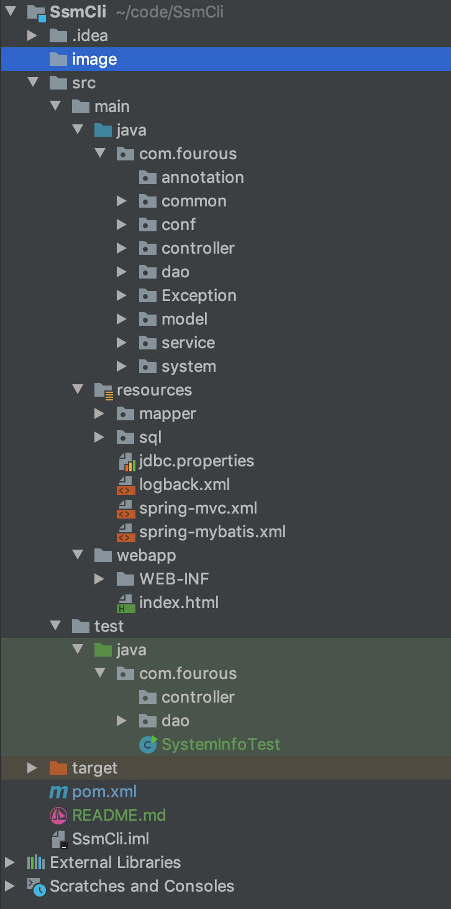
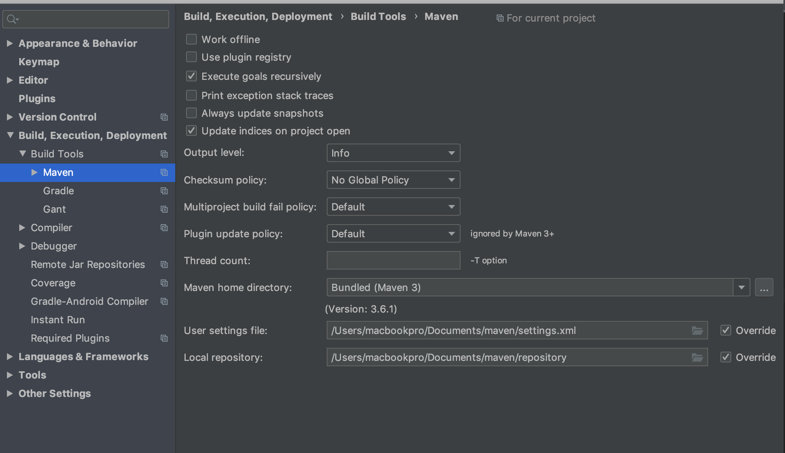
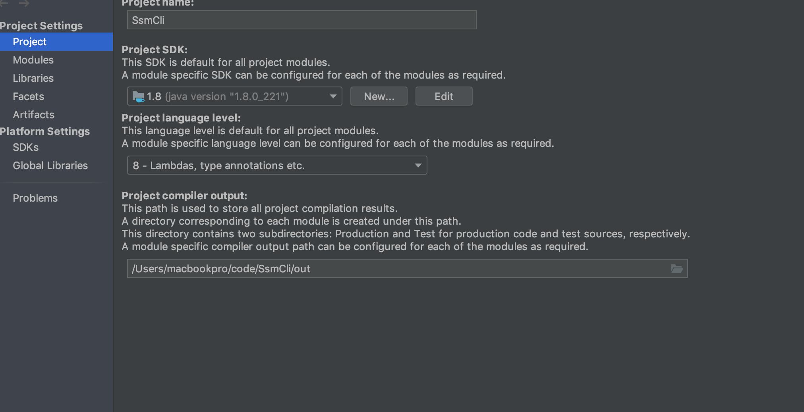
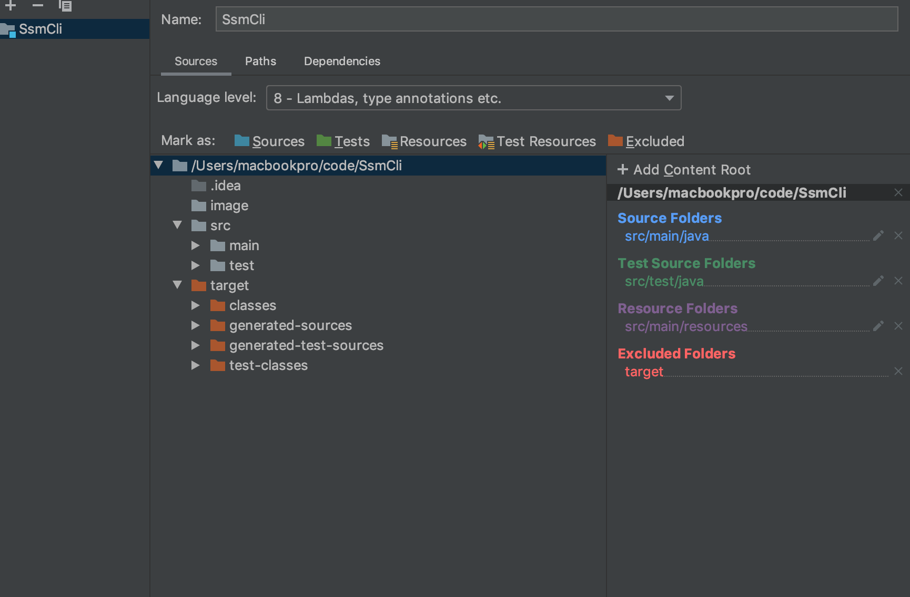

## SSM框架脚手架

  SSM框架是由Spring+SpringMVC+Mybatis构成，关于配置和编写都是比较繁杂，相对于SpringBoot这种轻量级框架要显得方便的多，但是封装的很厉害会导致对原理上的不理解。本脚手架配置了比较常规的解决方案，例如对于数据库连接池使用的druid，Json处理使用的是fastJson和Gson，并且在此基础上封装了大量的工具类和注释，避免因为类的封装过于方便带来调试上的麻烦。
  在SSM脚手架上面，采用MAVEN创建的标准目录结构，并且在此基础上面，加入了日志系统，缓存系统，异常处理系统，鉴权验证，配置文件系统，后端通信等。
  目前对于框架的整合代替了手写，造成对底层代码不熟悉，脚手架采用的都是自己封装的类和方法，都是基于现有解决方案的封装，例如对于StringUtil方法上，是在Spring中SpringFramwork的StringUtil基础上加入了其他方法和其他demo.慢慢会将其他的库依赖拆分，将使用的库透明化

### 项目结构

|     名称    |    参考库   |             作用              |
|------------|------------ |------------------------------|
|   Spring   | Spring      | Spring核心功能|
|   SpringMVC| SpringMVC| SpringMVC|
| mybatis|mybatis|ORM|
|druid|druid|数据库连接池|
|json|gson|json处理|
|StringUtil|org.apche.commons.lang3|字符串处理|

### 项目划分模块

| 功能模块 |细小划分| 使用技术或者类库 |
| --------|-------|--------|
|权限系统| 单点登录 license验证|AOP shiro|
|日志系统|日志处理|log4j|
|异常系统|异常处理|Spring exception|
|配置文件|配置更新 配置读取 配置控制|封装库confmanager|
|工具类|字符串 IO 系统|StringUtil SystemUtil IOUtil|
|加密|加密 解密|oshi RSA MD5|

### 使用方法
**idea 打开**
直接使用idea打开，但是前提是idea需要安装MAVEN，配置MAVEN不赘述，在打开项目时候，会让你选择MAVEN的相关配置，包括
MAVEN的版本和MAVEN的存储地址，最好采用自己本地下的配置地址，不要采用idea默认的地址。如果打开项目没有看到设置或者
没有安装MAVEN，则先打开项目，后面再配置，项目结构如图：

其中java中文件是源文件，resource是mapper，数据库，静态网页，配置文件等，test文件夹是测试文件，里面是对工具类，dao
等测试，可以直接运行单个文件。

### idea配置

* idea配置上面，首先是对于MAVEN的配置，这配置一般都可以在刚打开文件时候直接配置，但是如果没有安装本地MAVEN或者或者其他原因，会直接打开idea的默认MAVEN这样会导致文件系统发生混乱。

  这里注意，将下面的User settings file 和Local respository中的路径转换到自己本地安装的MAVEN目录下

  

* 对Project的配置，这里主要是要主要JDK的版本问题和输出问题，一般来说直接将输入文件夹也就是out或者target目录，但是可能会出现前后端的通信问题，最好是直接输出到resource中，生成class和静态文件，之类不赘述，目前还没有设置，因为目前项目还小，不会引发此问题。

  

* 对module的配置，在你打开的项目时候，这就是个Project，在一个project中可以配置多个module，例如在mybatis源码中，是需要加入parent 才可以完全运行的，加入的路径就是在module中运行，并且在开发多系统协作时候，是需要另外系统配合的。

  主要注意的事language中使用JDK8，并且需要指定source 等基本信息的，不然项目打开甚至Java文件都识别不了，这个就是让idea能识别项目文件的地方

